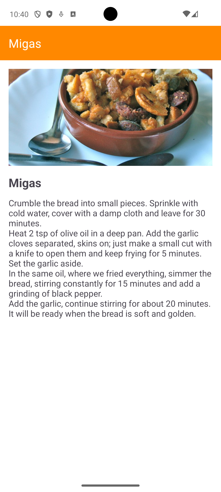

# Tablet Application

## Contents

## Software Language and Technology

- It is developed in Kotlin language.

## UI

<p align="center">
  
  
</p>

<p align="center">
  
  
</p>

## API Calls

BASE_URL: "https://www.themealdb.com/api/json/v1/1/"

#### Get Meal Lists

```
  GET /search.php?s="
```

#### Get Meal Details

```
  GET /lookup.php?i=53086"
```


